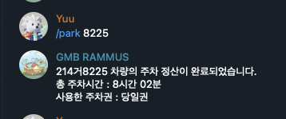

<p align="center">
  
</p>

# Rammus-bot

Telegram bot that helps with automatic parking payment processing for Xellop Parking System

## Requirements

```
pip install python-dotenv
pip install requests
pip install bs4
pip install python-telegram-bot
```

## Environment Setup

Create a `.env` file in the root directory with the following variables:

```
# Parking System Credentials
PARKING_BASE_URL="http://example.com"
PARKING_USERNAME="username"
PARKING_PASSWORD="password"

# Telegram Bot Token
TELEGRAM_BOT_TOKEN="your-telegram-bot-token"

# Authorized User IDs (comma-separated list of Telegram user IDs)
AUTHORIZED_USER_IDS="123456789,987654321"
```

## Usage

```
python rammus.py
```

## Commands

```
/start - Shows help message
/park [car_number] - Process parking payment for the specified car
```

## Security Features

- Environment variables for sensitive credentials
- User authorization based on Telegram user IDs
- Only authorized users can use bot commands
# xellop-parking-telegram-bot
# xellop-parking-telegram-bot
